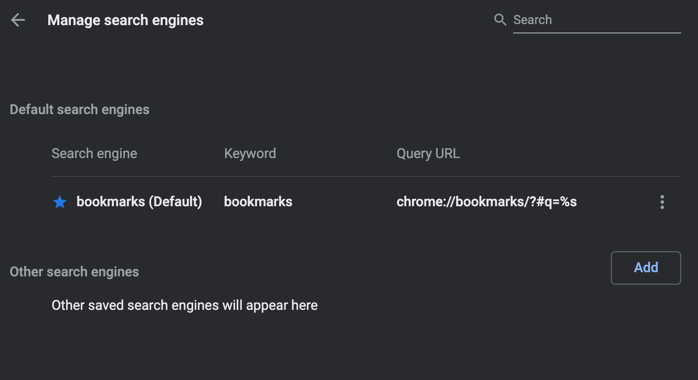

# k8s-bookmarks

## Setup Chrome for CKA & CKAD exam
- Create New Profile and Switch it in Chrome.
- Open [chrome://bookmarks/](chrome://bookmarks/).
- Import `bookmarks_CKA_CKAD.html` to bookmarks.
- Open [chrome://settings/searchEngines](chrome://settings/searchEngines).
- Create new search engine with Query URL(`chrome://bookmarks/?#q=%s`) and delete other search engines.
  
  
